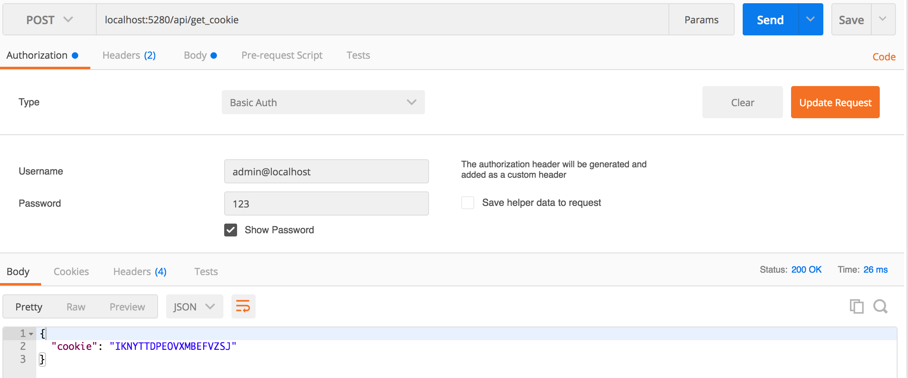

## ejabberd docker for Atlantis Home Server

### build ejabberd image and push

```bash
# sh ./build_docker 0.0.1
$ sh ./build_docker $VERSION
```

### ejabberd Major Port

* 5222 : TCP XMPP C2S Port
* 5280 : Admin, rest api Port

### ejabberd restAPI execution using poseman


* set api address to localhost:5280/api/get_cookie and Http Method to Post in postman
* add Authorization Type to Basic Auth and type username(admin), password(123)
* click Send and you can see erlang cookie value in response